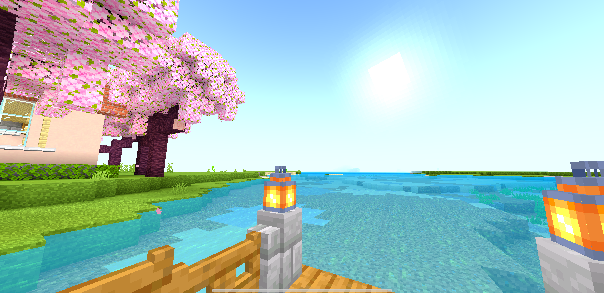

# Enhanced-vanilla-shader

## shader information

### logo

### shader description

a lite shader for low devices, with simple effects like:
> - New Sky
> - More Saturation
> - More Contrast
> - More Exposure
> - Falling star
> - Bright Moon
> - New Water
> - New Fog Color

## Screenshots

### Sunset 

### Day

### Noon

### Night 

## Download

[Download]()

+ Use with better render dragon on Windows

+ Use with Patchapp on Android 

+ And jailbreak or use ipa modified on iOS

-- End --
